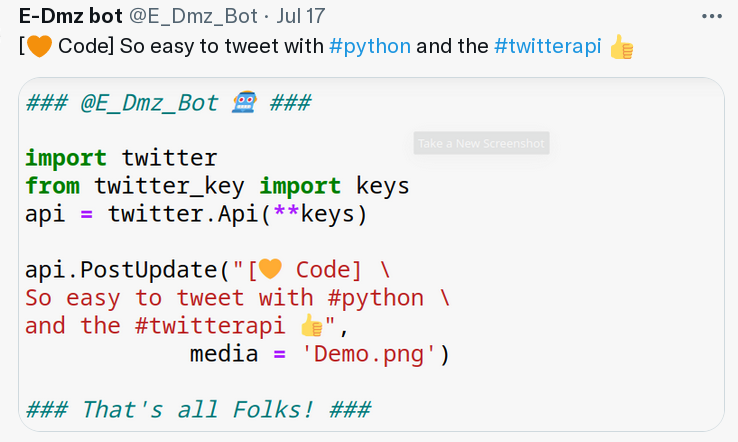
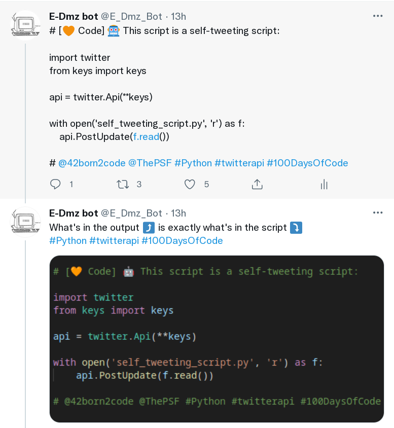
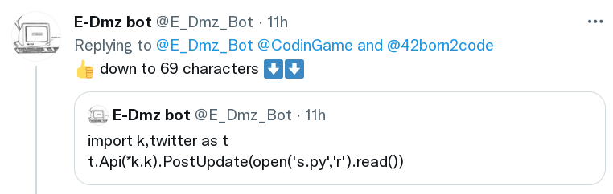

# SelfTweetingScript
## Goal 1️⃣ = examplify how you can tweet with Python and Twitter's API 
From a Jupyter notebook / VSCode / bash / cron job, using the 

* For this you need:
  * to pip install the python-twitter library 
  * to get keys for a Twitter API, in a dictionnary (keys) inside a module (keys.py)
  * screenshot to be displayed (here named Demo.png)

*If you want to DIY, use the key_template.py file and **make sure you're not publishing your own keys on GitHub***

## Goal 2️⃣ = make a **recursive script,** that tweets itself when executed
Here is the one I came up with:

## Goal 3️⃣ = make that script as short as possible
69 characters is the shorter I came up with:

* The dictionnary in the keys module was replaced by a list (to have it unpacked as `*k.k` instead of `**k.k`)
* The name of the script is s.py

*Can you make it even shorter? Please let me know!*
* is it possible to rename the "twitter" package as "t" on your machine? could spare 10+ characters
